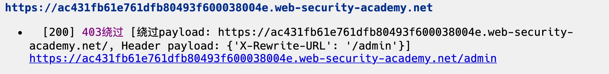

## 发现有好多人找我要这个项目，这里说一下，原项目已经使用 go 语言重构，变成了一款分布式资产扫描和漏洞扫描的工具，开源待定，本来想与"最伟大的作品"一起发布的，但有 bug 没改完，下次吧。

## 这个python版本也不再更新，bug 也有很多，python 版唯一的优点就是注释极多，适合新手学习

## SScan

[](https://github.com/yhy0/SScan/)

[](https://github.com/yhy0/SScan/)

### 前言

一款src捡洞扫描器，因没时间挖src，毕竟挖src是个费时费力的活，自19年8月起入坑至今，依靠 [BBScan](https://github.com/lijiejie/BBScan.git) 扫描出的信息和漏洞，利用业余时间从扫描报告中的资产**捡洞**和找洞，已经3次jd月度前十。萌发出自己写扫描器挖洞的念头，自动挖一些简单漏洞，赚点零花钱，同时提升一下开发能力，毕竟搞安全的不能不懂开发。

目前 [SScan](https://github.com/yhy0/SScan) 的主要逻辑还是在模仿 [BBScan](https://github.com/lijiejie/BBScan.git)。

### 使用效果图


扫描结束后，结果报告在report目录下，并且存在漏洞时，默认会使用浏览器打开报告

## 使用及参数

```bash
python3 SScan.py version                                查看版本
python3 SScan.py --help                                 获取帮助
python3 SScan.py --host example.com run                 单个目标
python3 SScan.py --file domains.txt run                 读取一个.txt文件
python3 SScan.py --dire /Users/yhy/Desktop/dirs/ run    读取目录下的所有.txt
python3 SScan.py --file domains.txt  --network 24 run   network设置一个子网掩码(8 ~ 31)，
                配合上面3个参数中任意一个。将扫描Target/MASK 网络下面的所有IP
python3 SScan.py --host 127.0.0.1 --script unauthorized_access_redis,unauthorized_access_rsync run
                    只使用指定脚本 

您可以通过在 config/setting.py 文件中指定fofa api信息, 调用fofa搜索更多的Web服务

其它参数：
    --t             扫描线程数, 默认10。
    --full          处理所有子目录。 /x/y/z/这样的链接，/x/ /x/y/也将被扫描，默认为True
    --crawl         爬取主页的<a>标签， 默认为True
    --checkcdn      检查域名是否存在CDN，若存在则不对解析出的ip进行规则和脚本探测，默认为True
    --browser       检测完成后，使用默认浏览器打开扫描报告，默认为True
    --script        指定要使用的脚本，--script unauthorized_access_redis unauthorized_access_rsync, ... 脚本在scripts目录下
    --rule          指定要扫描的规则，--rule RuleFileName1,RuleFileName2,... 规则在rules目录下
    --script_only   只使用脚本进行扫描，不使用规则
    --noscripts     不使用脚本扫描
    --fofa       是否使用fofa扩大目标，默认为True，通过在lib/config/setting.py 
```
## 功能

- [x] 常见目录扫描，比如备份文件、配置文件、日志文件等等，具体见`rules`目录下的详细规则

- [x] 信息泄露漏洞，比如.idea、 .git、.DS_Store、springboot等等，具体见`rules`目录下的详细规则

- [x] 后台登录页面资产发现

- [x] 403页面绕过，具体绕过规则在`lib/common/scanner.py`的196行的`bypass_403`函数

     使用BurpSuite 实验室[Lab: URL-based access control can be circumvented](https://portswigger.net/web-security/access-control/lab-url-based-access-control-can-be-circumvented) 进行测试

    

- [x] 扫描某个网段，比如通过 `--network 24` 指定扫描C段资产，进行漏洞和信息发现

- [x] 跳过存在CDN的IP，当检测到url解析的IP符合CDN特征时，不会将ip加入扫描目标中，只会扫描url

- [x] 一些常见未授权和弱口令检测，目前支持：

    redis、Hadoop、Hadoop yarn、docker、docker registry api、CouchDB、ftp、zookeeper、elasticsearch、memcached、mongodb、rsync、jenkins、jboss的未授权访问，mysql空口令、PostgreSQL 空口令 ，具体见`pocs/scripts` 目录
    
    对于数据库口令检测，目前只是检测是否存在空口令检测，后续会考虑要不要加入一些弱口令，进行检测。像这样 https://github.com/se55i0n/DBScanner/blob/master/lib/exploit.py
    
- [x] 当在` lib/config/setting.py`  文件中指定fofa api 信息时，会调用fofa接口，搜索更多的Web服务

## 后续计划

- [ ] ~~将[Packer-Fuzzer](https://github.com/rtcatc/Packer-Fuzzer)项目中的一些功能集成进去，能够对js文件中的敏感信息、API进行测试~~，添加此功能有点臃肿，而且有现成的(不是我懒)，1.0版本准备添加指纹识别，记录一个目标的各种信息，并生成报告，后续可以筛选出目标使用[Packer-Fuzzer](https://github.com/rtcatc/Packer-Fuzzer) 进行批量扫描
- [ ] 1.0版本添加指纹识别，记录一个目标的各种信息，并生成报告。
- [ ] 继续优化各模块


## rules目录下的规则描述

- black.list 规则黑名单，命中则跳过

- White.list 规则白名单 ，命中则认为存在薄弱点，加入结果

- rules目录下的一些字段含义，rules目录下常见的格式就是这种

    ```
    /WEB-INF/applicationContext-slave.xml {tag="<?xml"} {status=200} {type="xml"} {root_only}
    ```

    1. `/WEB-INF/applicationContext-slave.xml `目录 ，必有

    2. `{tag="<?xml"} `可选， 如果有的话，会比对 response.text ,即返回的html页面中是否存在tag，若没有，认为不存在该目录。

    3. `{status=200} `可选， 目录对应的状态码， 也是 作为判断该目录是否存在的一个条件，会比对页面的状态码和规则的状态码一致 

    4. `{type="xml"}` 可选，与返回头信息 content-type 字段比对，也是判断目录存在的一个条件

    5. `{root_only}` 可选， 这个是表示该目录只在网站根目录下存在，之后与网站根目录拼接，进行检测，比如 https://www.baidu.com/WEB-INF/applicationContext-slave.xml 这样检查一次， 在 https://www.baidu.com/test/ 这样的二级目录，并不会拼接检查，提高效率 ，

        ps：必有：是指当想要自己添加规则时，必须添加的字段，可选：可以没有，但想要更加准确，最好写上。

        具体匹配检测在`lib/common/scanner.py` 的523行

## 如何编写脚本插件

请参考scripts文件夹下的插件内容。self参数是一个Scanner对象(lib/common/scanner.py)，可使用Scanner对象的任意方法、属性。

`self.host` `self.port` 是目标主机和端口

`self.ports_open` 是开放的端口列表，是所有插件共享的。 一般不在插件执行过程中再单独扫描端口

`self.session` 是HTTP连接池

`self.http_request` 可发起HTTP GET请求

`self.index_headers` `self.index_status` `self.index_html_doc` 是请求首页后返回的，一旦扫描器发现有插件依赖，会预先请求首页，保存下来，被所有插件公用

## 参考

- [BBScan](https://github.com/lijiejie/BBScan.git)
- [oneforall](https://github.com/shmilylty/OneForAll.git) 
- [BurpSuite_403Bypasser](https://github.com/sting8k/BurpSuite_403Bypasser)
- [记一次403绕过技巧](https://mp.weixin.qq.com/s?__biz=MzAwMzYxNzc1OA==&mid=2247489824&idx=1&sn=83d370a391fa8269c12848d87a62240a&chksm=9b393f91ac4eb687328e676b3ed0710078d5cb2d3185e0d38d5e7bd92403840d0fc224b443ba&mpshare=1&scene=24&srcid=12289jnCaJEnQZ4ZGqKk1uGX&sharer_sharetime=1609151769170&sharer_shareid=6806da86371afa965c2b99ffa8f84bab#rd)
- [Asyncio并发编程](http://www.langzi.fun/Asyncio%E5%B9%B6%E5%8F%91%E7%BC%96%E7%A8%8B.html)
- [Scanunauthorized](https://github.com/test502git/Scanunauthorized)
- [Frog-Auth](https://github.com/timwhitez/Frog-Auth/blob/main/pocs/pocs.py)

## 免责声明

本工具仅能在取得足够合法授权的企业安全建设中使用，在使用本工具过程中，您应确保自己所有行为符合当地的法律法规。 
    如您在使用本工具的过程中存在任何非法行为，您将自行承担所有后果，本工具所有开发者和所有贡献者不承担任何法律及连带责任。
    除非您已充分阅读、完全理解并接受本协议所有条款，否则，请您不要安装并使用本工具。
    您的使用行为或者您以其他任何明示或者默示方式表示接受本协议的，即视为您已阅读并同意本协议的约束。

## Star趋势

[](https://starchart.cc/yhy0/SScan)
      